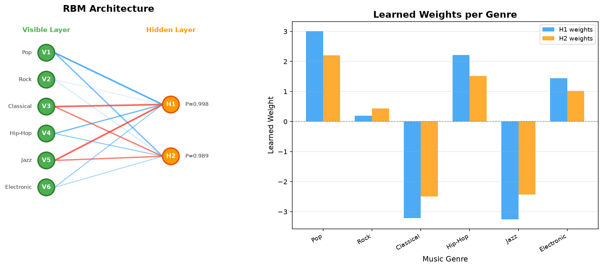

# Restricted Boltzmann Machine — Music Listener Preference Demo

## Problem Statement

A music service represents listener choices using visible variables and hidden preference features. Construct a simple RBM with the specified visible and hidden units, apply one listener vector conceptually to the visible layer, and demonstrate the resulting hidden representation.

## Objective

Build a simple Restricted Boltzmann Machine (RBM) from scratch using Python and NumPy to demonstrate how a music service can represent listener preferences.

The project will:

1. Create an RBM with **6 visible units** (music genre preferences) and **2 hidden units** (latent preference features).
2. Use a small binary dataset of listener preferences.
3. Train the RBM using a simple Contrastive Divergence (CD-1) learning procedure.
4. Show how a listener's preference vector is transformed into a hidden representation.

## Concept of RBM

A **Restricted Boltzmann Machine (RBM)** is a type of generative neural network with two layers:

- **Visible layer** — represents the observed data (in our case, whether a listener likes a music genre or not).
- **Hidden layer** — represents latent (hidden) features learned from the data.

The key restriction is that there are **no connections within the same layer** — visible units are only connected to hidden units, and vice versa. This restriction makes the RBM computationally efficient to train.

### How an RBM Works

1. Each connection between a visible unit and a hidden unit has a **weight**.
2. Each unit has a **bias** value.
3. The **sigmoid function** converts the sum of weighted inputs into a probability between 0 and 1.
4. The RBM learns by adjusting weights so that it can reconstruct the input data from the hidden representation.

## Visible Layer

The visible layer has **6 units**, each representing a music genre preference:

| Unit | Genre | Value |
|------|-------|-------|
| V1 | Pop | 1 = likes, 0 = does not like |
| V2 | Rock | 1 = likes, 0 = does not like |
| V3 | Classical | 1 = likes, 0 = does not like |
| V4 | Hip-Hop | 1 = likes, 0 = does not like |
| V5 | Jazz | 1 = likes, 0 = does not like |
| V6 | Electronic | 1 = likes, 0 = does not like |

## Hidden Layer

The hidden layer has **2 units** representing latent preference features:

| Unit | Conceptual Interpretation |
|------|--------------------------|
| H1 | Latent Preference Pattern 1 |
| H2 | Latent Preference Pattern 2 |

> **Important Note:** Hidden units learn latent features from data automatically. They do not receive human-readable labels. Any interpretation (e.g., "Mainstream preference" or "Instrumental preference") is a conceptual approximation based on the learned weights — not a built-in label.

## Dataset Description

The project uses a small dataset of **10 listeners** with binary music genre preferences.

File: `data/listener_preferences.csv`

| Listener | Pop | Rock | Classical | Hip-Hop | Jazz | Electronic |
|----------|-----|------|-----------|---------|------|------------|
| L1 | 1 | 1 | 0 | 1 | 0 | 1 |
| L2 | 1 | 0 | 0 | 1 | 0 | 1 |
| L3 | 0 | 1 | 1 | 0 | 1 | 0 |
| L4 | 1 | 1 | 0 | 0 | 0 | 1 |
| L5 | 0 | 0 | 1 | 0 | 1 | 0 |
| L6 | 1 | 0 | 0 | 1 | 0 | 1 |
| L7 | 0 | 1 | 1 | 0 | 1 | 0 |
| L8 | 1 | 1 | 0 | 1 | 0 | 1 |
| L9 | 0 | 0 | 1 | 0 | 1 | 1 |
| L10 | 1 | 1 | 0 | 1 | 0 | 0 |

The dataset contains two natural preference patterns:
- **Group A (L1, L2, L4, L6, L8, L10):** Prefer Pop, Hip-Hop, Electronic
- **Group B (L3, L5, L7, L9):** Prefer Classical, Jazz

## Methodology

### Step 1: Initialize the RBM
- Weight matrix `W` of shape (6, 2) initialized with small random values.
- Visible bias and hidden bias initialized to zero.
- Fixed random seed (42) for reproducibility.

### Step 2: Load Data
- Read the CSV dataset into a NumPy array.
- Each row is one listener's binary preference vector.

### Step 3: Train Using Contrastive Divergence (CD-1)
For each training sample in each epoch:
1. **Positive phase:** Compute hidden probabilities from visible input using `P(h=1|v) = sigmoid(v·W + hidden_bias)`.
2. **Sample hidden units:** Convert probabilities to binary values using stochastic sampling.
3. **Reconstruction:** Generate visible reconstruction from hidden sample using `P(v=1|h) = sigmoid(h·W^T + visible_bias)`.
4. **Negative phase:** Compute hidden probabilities from reconstruction.
5. **Update weights:** `W += learning_rate × (positive_associations - negative_associations)`.
6. **Update biases:** Similarly adjust visible and hidden biases.

### Step 4: Demonstrate Hidden Representation
- Apply a listener vector to the trained RBM.
- Show step-by-step calculation of hidden activation probabilities.
- Convert to binary hidden representation using threshold 0.5.

### Step 5: Visualize Results
- Generate an RBM architecture diagram.
- Create a bar chart of learned weights per genre.

## Project Structure

```
A-music-service-represents-listener-choices-using-Restricted-Boltzmann-Machines/
│
├── README.md                              # Project documentation
├── requirements.txt                       # Python dependencies
│
├── data/
│   └── listener_preferences.csv           # Listener preference dataset
│
├── src/
│   └── rbm_music.py                       # Main RBM implementation
│
├── results/
│   ├── hidden_representation.txt          # Text output of results
│   └── rbm_result.png                     # Visualization
│
├── screenshots/
│   └── output.png                         # Terminal output screenshot
│
└── report/
    ├── project_report.md                  # Detailed project report
    └── viva_questions.md                  # Viva preparation Q&A
```

## Installation

1. Clone the repository:
```bash
git clone https://github.com/msdillikumar/A-music-service-represents-listener-choices-using-Restricted-Boltzmann-Machines.git
cd A-music-service-represents-listener-choices-using-Restricted-Boltzmann-Machines
```

2. Install dependencies:
```bash
pip install -r requirements.txt
```

Dependencies:
- `numpy` — numerical computation
- `matplotlib` — visualization

## How to Run

```bash
python src/rbm_music.py
```

The program will:
1. Load the listener preference dataset.
2. Initialize the RBM with 6 visible and 2 hidden units.
3. Show hidden representation before training (random weights).
4. Train the RBM using CD-1 for 500 epochs.
5. Show hidden representation after training (learned weights).
6. Display reconstruction demo.
7. Show all listeners' hidden representations.
8. Save results to `results/hidden_representation.txt`.
9. Save visualization to `results/rbm_result.png`.

## Sample Output

```
=======================================================
Restricted Boltzmann Machine - Music Preference Demo
=======================================================

Dataset loaded: 10 listeners, 6 genres
Genres: ['Pop', 'Rock', 'Classical', 'Hip-Hop', 'Jazz', 'Electronic']

--- RBM Structure ---
Visible units: 6
Hidden units:  2
Weight matrix shape: (6, 2)

=======================================================
TRAINING THE RBM
=======================================================

Training with CD-1 for 500 epochs, learning rate = 0.1

  Epoch  100/500 - Reconstruction error: 1.2756
  Epoch  200/500 - Reconstruction error: 0.7665
  Epoch  300/500 - Reconstruction error: 0.5552
  Epoch  400/500 - Reconstruction error: 0.5149
  Epoch  500/500 - Reconstruction error: 0.4988

=======================================================
AFTER TRAINING (learned weights)
=======================================================

Listener input vector:
  Pop: 1 (likes)
  Rock: 1 (likes)
  Classical: 0 (does not like)
  Hip-Hop: 1 (likes)
  Jazz: 0 (does not like)
  Electronic: 1 (likes)

Hidden activation probabilities:
  H1 (Latent Feature 1): 0.9978
  H2 (Latent Feature 2): 0.9892

Hidden representation (threshold 0.5): [1 1]
```

## Result

### Visualization



### Learned Weight Analysis

After training, the RBM learned the following weight patterns:

| Genre | H1 Weight | H2 Weight | Interpretation |
|-------|-----------|-----------|----------------|
| Pop | +3.01 | +2.21 | Strongly activates both hidden units |
| Rock | +0.19 | +0.44 | Weakly activates (shared across groups) |
| Classical | -3.21 | -2.49 | Strongly suppresses both hidden units |
| Hip-Hop | +2.22 | +1.52 | Strongly activates both hidden units |
| Jazz | -3.25 | -2.43 | Strongly suppresses both hidden units |
| Electronic | +1.45 | +1.02 | Moderately activates both hidden units |

### Hidden Representations

| Listener Group | Genres Preferred | Hidden Representation |
|----------------|------------------|-----------------------|
| L1, L2, L4, L6, L8, L10 | Pop, Hip-Hop, Electronic | [1, 1] |
| L3, L5, L7, L9 | Classical, Jazz | [0, 0] |

The RBM successfully learned to distinguish between the two preference patterns in the data.

## Conclusion

This project demonstrates the basic working of a Restricted Boltzmann Machine:

1. An RBM can learn latent features from binary data without supervision.
2. The visible layer represents observable preferences (music genres).
3. The hidden layer captures underlying preference patterns.
4. Contrastive Divergence (CD-1) is a simple and effective training algorithm for RBMs.
5. After training, the RBM can encode listener preferences into a compact hidden representation.
6. The RBM can also reconstruct visible preferences from hidden representations.

### Limitations

- This is a small educational demo with only 10 listeners and 2 hidden units.
- A production system would require a much larger dataset and more hidden units.
- The RBM uses basic CD-1; more advanced methods (CD-k, PCD) exist.
- Hidden unit interpretations are approximate and conceptual.

## References

1. Hinton, G. E. (2002). "Training Products of Experts by Minimizing Contrastive Divergence." *Neural Computation*, 14(8), 1771-1800.
2. Fischer, A., & Igel, C. (2012). "An Introduction to Restricted Boltzmann Machines." *Progress in Pattern Recognition, Image Analysis, Computer Vision, and Applications*, 14-36.
3. Hinton, G. E. (2010). "A Practical Guide to Training Restricted Boltzmann Machines." *Technical Report, University of Toronto.*
4. Salakhutdinov, R., Mnih, A., & Hinton, G. (2007). "Restricted Boltzmann Machines for Collaborative Filtering." *Proceedings of the 24th International Conference on Machine Learning.*
5. NumPy Documentation — https://numpy.org/doc/
6. Matplotlib Documentation — https://matplotlib.org/stable/